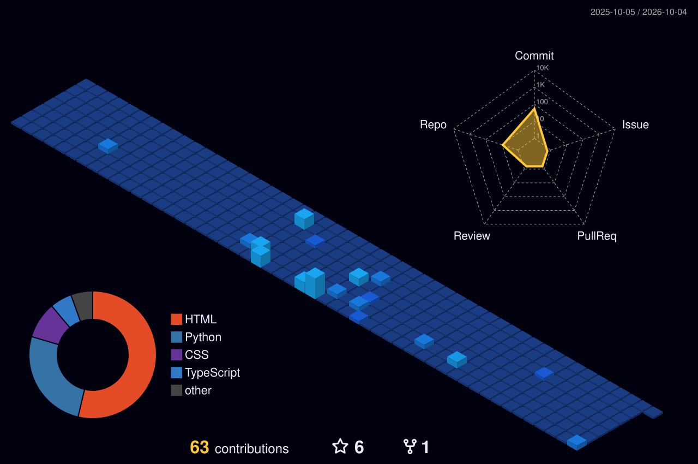

<!-- 🎬 HERO — video intro + name -->

  

<!-- 👨‍💻 LEFT: what I build   •   RIGHT: life outside code -->

  

<!-- ⚙️ TECH STACK -->

  

<!-- 🪪 DEVELOPER ID + DASHBOARD -->

  

## 🚀 Featured builds

| Project | What it is | Stack | Stars |
|:---|:---|:---|:---:|
| [**RankResume.pro**](https://rankresume.pro) | AI-powered resume platform with ATS optimization and keyword matching | `AI` `Web` | — |
| **Nova** | Free live talking AI character: LLM brain, voice and lip-synced avatar | `Python` `FastAPI` `Groq` | — |
| **EmoSense** | Human emotion analysis platform with live demo and dashboard | `HTML` `CSS` `JS` `Firebase` | — |
| **Lumina** | AI-powered Android photo editor (in design) | `Android` `AI` | — |

 

## 🌃 My contribution city

*Every commit builds another tower — rebuilt automatically every day.*

  

<!-- 💌 LET'S CONNECT -->

  

 

**Always learning, always building.** 💜

